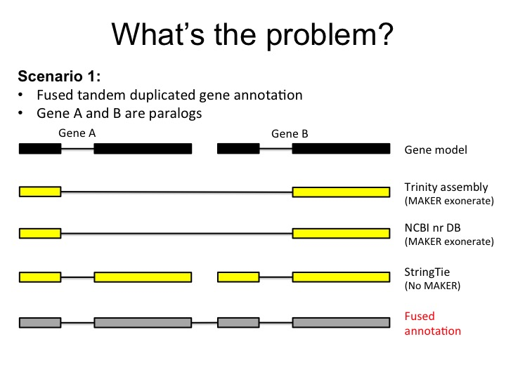
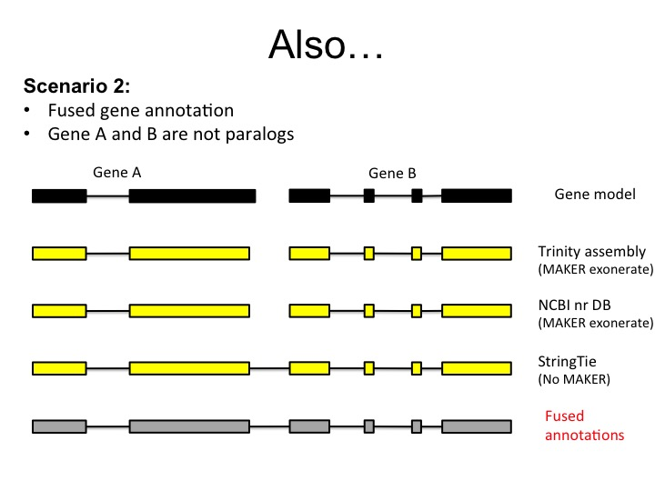
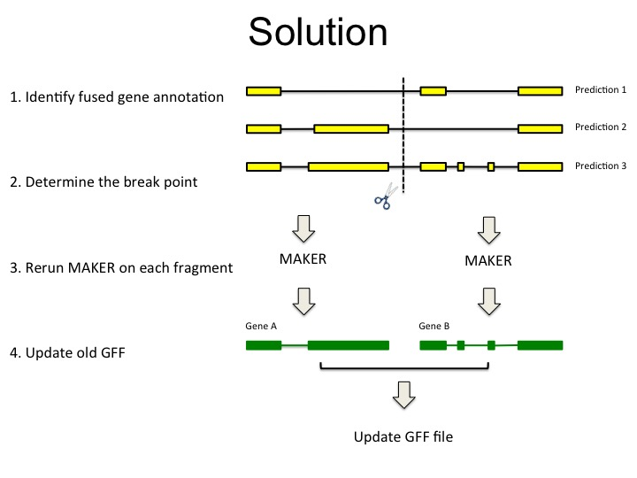

Introduction
===========================================================

deFusion - a tool to entangle MAKER fused genome annotation

deFusion is a python module developed to solve fused annotation problems experienced while
using MAKER for whole genome annotation.

There are two types of fused gene annotations by MAKER:

1. fused tandem duplication genes
2. fused chimera genes

Scenario1 - tandem duplicated fused gene annotation
---------------------------------------------------
Lots of metabolite related genes, especially in plants, are tandemly arrayed in
plant genomes. MAKER informed by the transcript alignment by exonerate, which
often concatennates those genes into a fused gene.

Scenario2 - chimera fused gene annotation
-----------------------------------------
StringTie transcript provided a high-quality transcript evidence for MAKER genome
annotation, however, the noise present in the RNA-seq reads may cause falsely
joint of two physically closely related genes.

Solutions
---------

