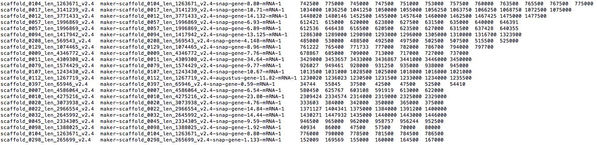
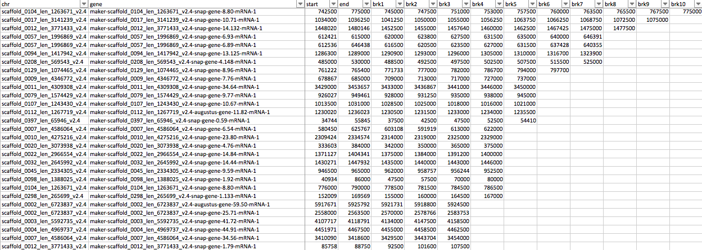
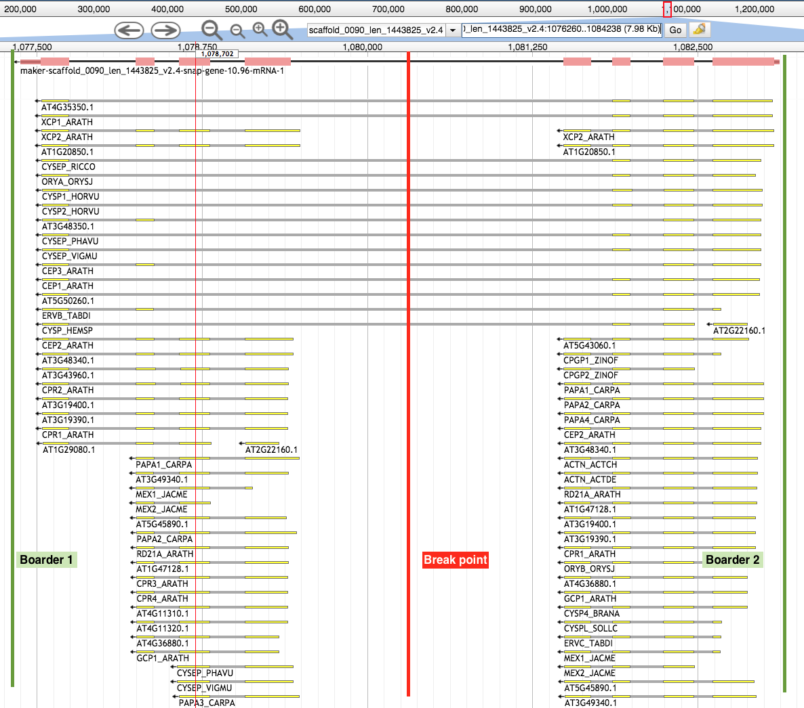
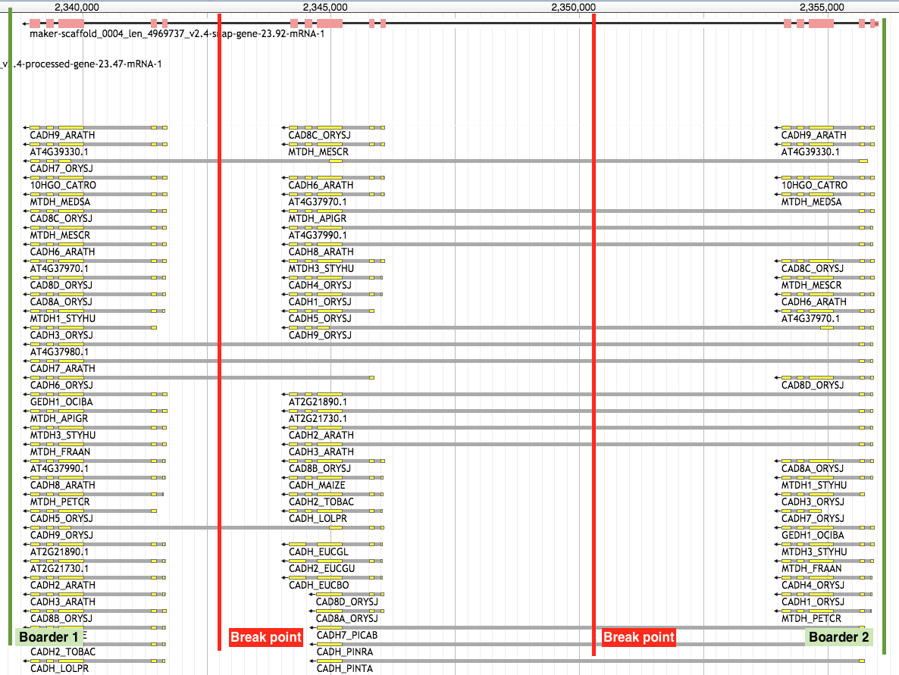
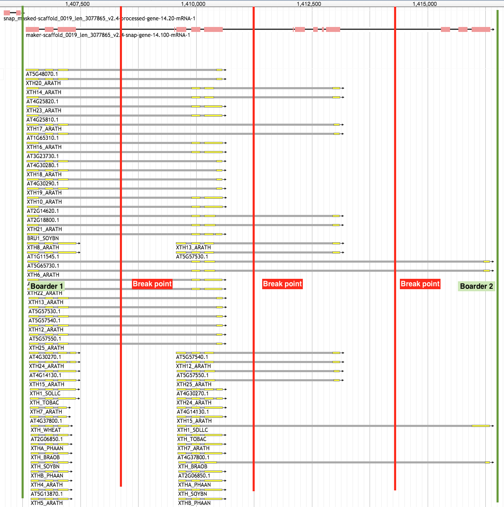
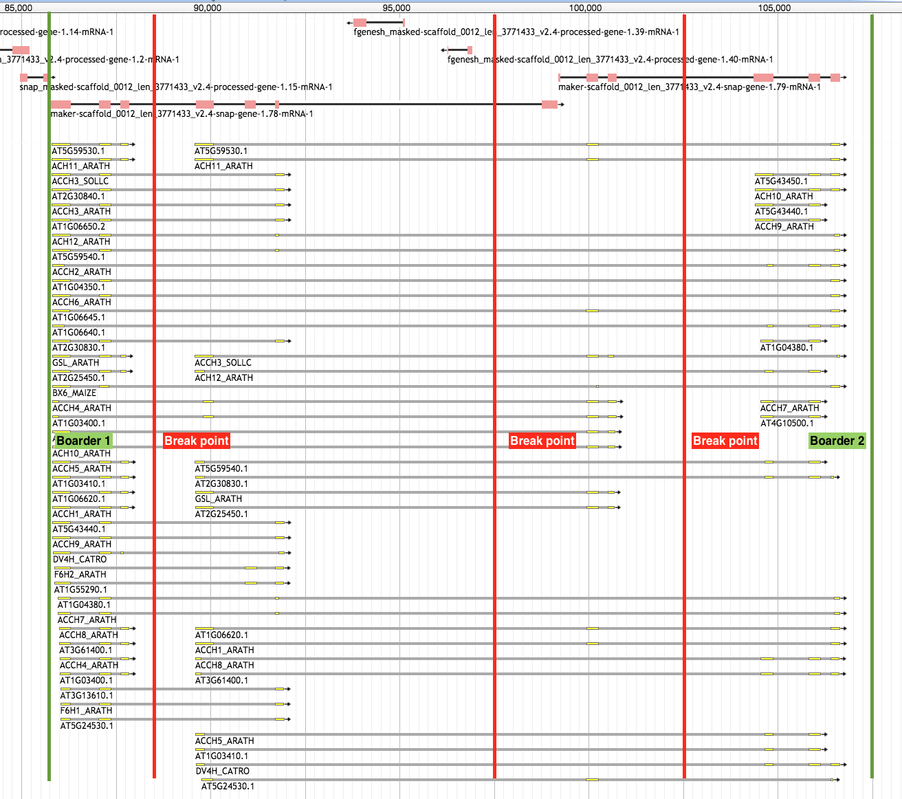

How to make a .brk file
=======================

A .brk file is the file format that created to locate the fused gene split point coordinate(s). In addition to the 
coordinate information, chromosome or scaffold sequence ID and fused gene ID are also included. Below is an example of 
the `.brk format`_.

Open .brk file in a text editor:

Open .brk file in MS excel:

By default, the mid point of putative fused gene models are suggested as breaking point to split putative fused genes,
but the breaking point for the gene models with 3 or more fused genes need to be manually curated. To determine the 
breaking points, gene models need to be visualized in a genome browser, such as Jbrowse_.

Prerequisites
-------------

 * Complete step 1: detect fused genes
 * .brk file: breaking_point.brk
 * Text editor, MS Excel or other alternatives
 * Load your MAKER genome annotation into a genome browser, such as Jbrowse_

Setup Jbrowse_ instance
-----------------------

To install Jbrowse and setup Jbrowse instance, please refer to Jbrowse_tutorial_. 

Fused gene model - scenario 1
-----------------------------

Fused gene model - scenario 2
-----------------------------

Fused gene model - scenario 3
-----------------------------

Fused gene model - scenario 4
-----------------------------

Edit .brk file in text editor or MS excel
-----------------------------------------

The most convenient way to edit the .brk file is in the MS excel or other tab-delimited editor GUI alternatives. 

.. _Jbrowse_tutorial: http://gmod.org/wiki/JBrowse_Tutorial_PAG_2016
.. _Jbrowse: https://jbrowse.org/demos/
.. _.brk format: /file_format.html